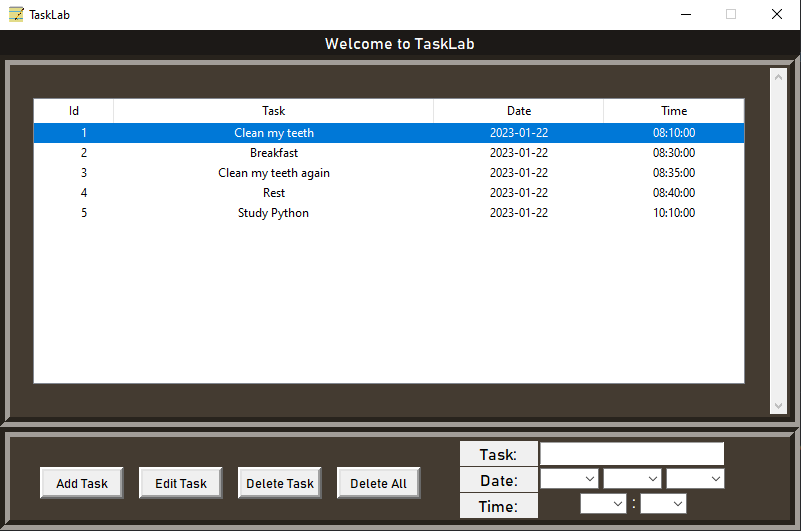
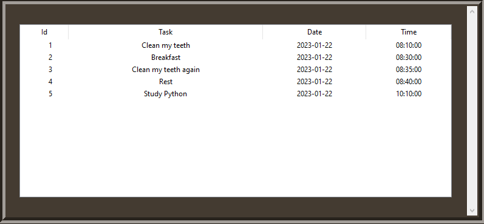
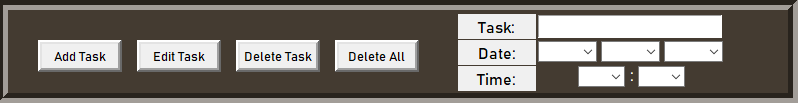

    
    <h1 align="center">TaskLab</h1>
    
Task Lab is a "day manager". This app can register your tasks for allow you to organizate your time.

     

     
    

     
    <h2 align="center">Content📥</h2>
    
The app contains a simple interface where you can add, edit, update and delete (CRUD) your task.

     
    <h3>Treeview</h3>
    
    
This Treeview contains all the tasks, each is separated by 4 columns: Id, Task, Date and Time. They show the data.

     
    <h3>Management Bar</h3>
    
    
This bar allows you to manage the Treeview.

     
    
ADD: First, you need to write the task and select the date and time. Next, press the 'Add Task' button.

    
EDIT: Select the task that you want to edit, next, write the new data on the fields. Lastly, press the 'Edit task' button.

    
DELETE: Select the task that you want to delete and press the 'Delete Task' button.

    
DELETE ALL: Just press the 'Delete All' button and confirm your wish in the new window that will be appear.

     
    

     
    <h2 align="center">Developement💻</h2>
    
Note: The '/git_images' directory is just for upload the images for this README.md

     
    
This App was developed with the Model-View-Controller(MVC) design pattern.

    
All the code was writed trying to have the clean code tips. You will see comments on the code that will help you to understand how the code works.

    
    
Has you can see, we have 3 folders: Model, View and Controller. Lastly, a execute.py

     
    
Controller: In this folder we have the controller.py | This archive makes all the management for the app. Receive the information from app.py and connect_bd.py and sends the information between they too.

    
Model: In this folder we have the connect_bd.py | This archive contains all the database query methods. Creates the connection with the database and sends the data to controller.py

    
View: In this folder we have the app.py | This archive is responsible for create the root and all the widgets for the app. It is just for the frontend.

     
    

     
    <h1>✉Contact📞</h1>
     
    <h2>📩e-mail = jizdsing@gmail.com | 📱 Whatsapp = <a href="https://wa.me/584142383498">+584142384398</a> | Portfolio = <a href="https://atreyusrey.pythonanywhere.com/">https://atreyusrey.pythonanywhere.com/</a></a></h2>
     

